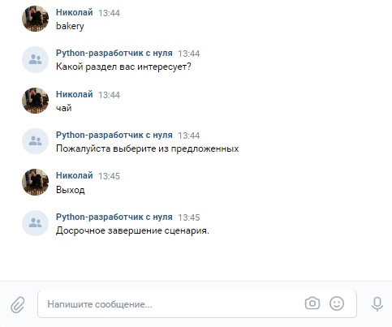

# vk-bot-bakery
# Задача:
    Спроектировать и создать чат-бота в VK (сообщения сообществ. все работает через официальное api. 
    Подключение к VK работа через longpoll)
    
    Логика:
    Витрина выпечки/кондитерской. 3-4 раздела, в каждом по 2-3 товара.
    У товара описание и фотография. Из раздела можно возвращаться назад.
    
    Для навигации использовать кнопки.
# Запуск
    Для запуска необходимо передать свой токен и id группы:
    Вариант 1:
        1. Создать файл applicaton/secrets.py
        2. В файле 2 строки:
            GROUP_ID: int = id группы
            TOKEN: str = токен
    Вариант 2:
        Запуск через терминал команды:
        1. cd application
        2. python3 main.py --token=a8..c --group_id=1111
            где a8..c - ваш токен, 1111 - id группы
# Запуск тестов:
    1. cd application
    2. pytest tests.py
    
# Пояснение к структуре:
    application (Папка с проектом)
       |---> bot (Логика бота)
       |      |-> bot.py (Основной класс Bot)
       |      |-> handler_bot_answer.py (Обработчик сообщений от бота)
       |      |-> handlers_user_answer.py (Обработчик сообщений от пользователя: проверка входных данных)
       |      |-> keyboard.py (Класс клавиатура)
       |        
       |---> models (Взаимодействие с sqlite)
       |         |-> __init__.py (создание и описание моделей)
       |         |-> handlers.py (Обработчик событий для клавиатуры: выдает значения для кнопок)
       |         |-> product.py (Основные запросы к т. продукты)
       |         |-> section.py (Основные запросы к т. секция)
       |         |-> user.py (запросы к бд пользователи)
       |
       |---> photo (Фотографии продуктов)
       |         |-> .... (фотографии)
       |
       |--> log.py (Логирование приложения)
       |--> main.py (Основной файл запуска)
       |--> requirements.txt (Файл с зависимостями)
       |--> settings.py (Файл с настройками и сценарием)
       |--> secrets.py (Файл с токеном и id группы) ***Необходимо создать
       |--> tests.py (Файл с тестами) #
       bot_work_illustrations (Фотографии для README.md)
       README.md (сейчас тут)
       
# Иллюстрация работы бота:
    Команда /help
 
        
    Команда /bakery (Начало сценария /bakery)

    Валидный проход по сценарию /bakery (Выбор раздела)

    Валидный проход по сценарию /bakery (Выбор продукта)

    Не валидный проход по сценарию /bakery

    
    Нажатие на кнопку Выход /bakery

    Нажатие на кнопку Назад

    